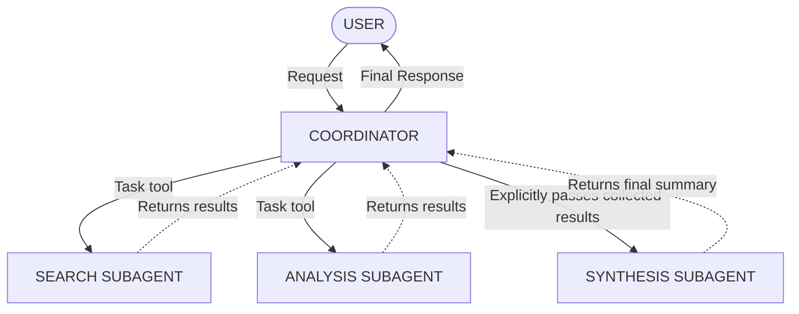

# Multi-Agent Orchestration (Hub-and-Spoke Pattern)

> **Critical Rule:** Subagents do NOT share memory. They do NOT see each other's results. Only the coordinator sees all results and must pass context explicitly.

# Coordinator prompt

### CORRECT: Coordinator explicitly passes ALL context:
COORDINATOR PROMPT TO SYNTHESIS SUBAGENT:
"Combine the following findings:
SEARCH RESULTS: {paste search agent output here}
DOCUMENT ANALYSIS: {paste analysis agent output here}
Preserve source URLs and dates. Report conflicts."

# WRONG — subagent has no memory of 'earlier':
"Synthesise the research that was done earlier."